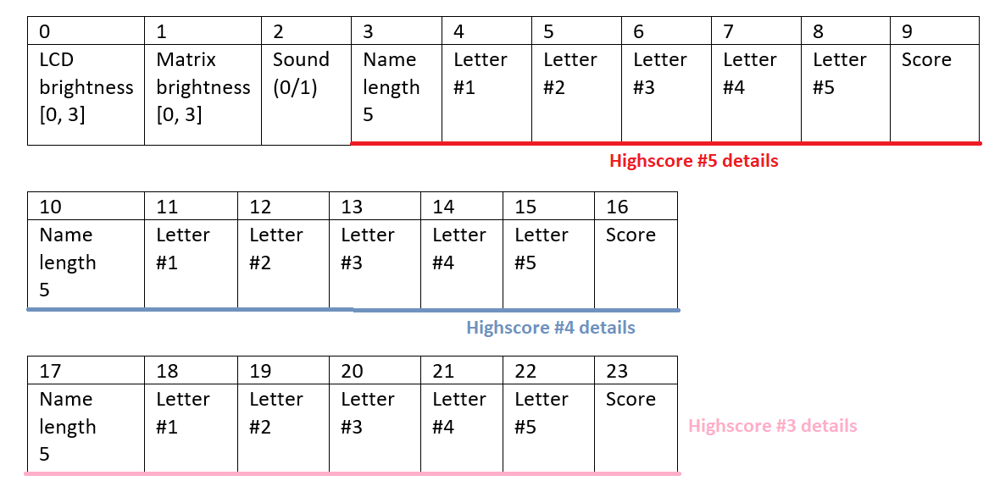
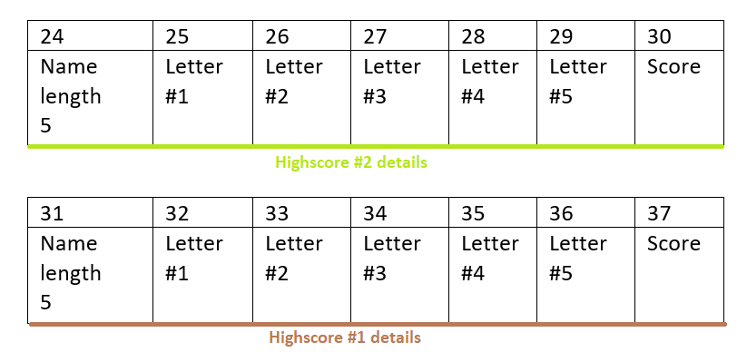

# Snake Game :joystick:
Snake game developed within the "Introduction to Robotics" course, 3rd year, 1st semester.  

[Introduction](#introduction)

## Introduction 
&ensp; This project consists of an extended snake game along with an intuitive menu designed to customize the playing session after user's preferences and, at the same time, to facilitate the user's experience. I have chosen to develop this game because I wanted to make the classic snake game more fun and interesting. With that in mind, I have created 2 more ways to play the game, one more difficult than the other, based on the classic game.   
&ensp; The whole project was a challenge, not only because I wanted to improve the existing snake game, but also since it was my first time developing something this big that combines hardware and software. 

## Game description
&ensp; The game itself is displayed on the 8x8 matrix and the game status (score, level -each food eaten increases the level with 1, regardless of the difficulty-, lives) can be seen on the LCD display. The main idea of the game is that the player has to eat as many foods as they can, in order to increase score. The game is focused on the score, and not on the time the player takes to play. The food is generated random at the beginning of the game and each time the snake eats one. Additionally, the food is distinguished from the snake and other obstacles by the fact that it is blinking.   
&ensp;  At the beginning of each game the snake has a length of 2 and is moving in a horizontal direction, starting from the second column of the row #3. Also, there are 2 lives per game and the final score consists of the sum between the scores obtained using both lives. After finishing the game, the player is informed of the score obtained and if the score is in top 5, they have to select a 5-letter name to be displayed in the highscore list, along with the score.   
There are 3 difficulty levels the player can choose from the menu:  

- **EASY**:  
&ensp; The snake is moving as the player moves the joystick in one of the 4 directions -up, down, left, right- and increases in size after each food eaten. Moreover, the speed of the snake also increases gradually after each food eaten. Although the speed might not seem to differ at first, it gets really obvious when the snake gets longer. It is possibile to teleport through the walls, meaning that if the snake exits the matrix it is immediately reappearing in the opposite side of matrix, as if the matrix is circular. Each food eaten represents one point to the score.

- **MEDIUM**:   
&ensp; This level is built starting from the previous one's logic and has one addition. Three random generated walls are added at the very beginning of the game. Even though they are random, they respect a few rules:
1. They have the length of 2 on the matrix
2. Each wall is generated in a specific area and has a predefined orientation, as described in the photo:
   

&ensp; Each food eaten represents 2 points to the score.

- **HARD**:   
&ensp; The last difficulty level takes the elements from the previous ones and comes with a fun challenge! The snake can now teleport only if the corresponding matrix  walls are 'activated'. They are marked using LEDs of 2 different colors (blue for left and right and yellow for up and down). This time the player has to use both hands to play, one for the joystick control and the second for pressing the button when needed. Each food eaten represents 3 points to the score.   

:pause_button: No matter the difficulty selected, the player can PAUSE the game if the joystick button is pressed for a few moments. The matrix freezes completely and to resume the game the player has to press again the joystick button. 

## How to play

- **EASY**: move using joystick, eat food to increase score, you can teleport through matrix walls, be careful to not crash into yourself!   
- **MEDIUM**: EASY rules + avoid the fixed walls and be careful to not crash into these as well!
- **HARD**: MEDIUM rules + can teleport through matrix walls only if the corresponding LEDs are ON (blue :large_blue_circle: - left & right, yellow :yellow_circle: - up & down). Press the button near the LEDs to switch the direction.   

## Menu description
The menu can be navigated using the joystick and contains the following categories:
- **Start game**: actually starts the game in the difficulty level selected in the settings
- **Highscore**: here is the top 5 highscores obtained; at the bottom of the list there is an option to reset the highscore list by pressing the joystick button
- **Settings**
    - **Difficulty**
        - **EASY** 
        - **MEDIUM**
        - **HARD**
     - **LCD brightness**: can increase or decrease the LCD brightness by moving the joystick up/down. There are 4 options that can be selected
     - **MTR brightness**: can increase or decrease the matrix brightness by moving the joystick up/down. There are 4 options that can be selected and whole matrix lights up at this point
     - **Sound**: can toggle between ON and OFF by moving the joystick up/down
 - **About**: info about the creator of the game (me! :smile:) and the github account can be seen here, displayed in a scrolling text manner, with the first line being static
 - **How to play**: instructions for each difficulty level can be read here, displayed in a scrolling text manner, with the first line being static

To enter a submenu the user has to move the joystick to the right and to exit it, the joystick has to be moved to the left.

## Other details :star2: 
1. **Greeting**: when powering the game, a greeting message is displayed on the LCD display and the matrix as well  
2. **Sound**: different sounds are used in different scenarios: navigating the menu, eating food while playing, losing a life.
3. **Memory**: the settings selected by the user (sound on/off, LCD brightness, matrix brightness) along with the highscore list that contains name and score are saved in the **EEPROM** memory. The memory distribution can be seen in the following schema:
 
    
    

4. **Matrix pictures**: when navigating through the menu, the matrix displays a picture related to the current category selected (noticeable in the video). Also, when the player reaches top 5, a smiley face appears on the matrix  
5. **Motivational messages**: after the player loses all the lives, a motivational message extracted randomly from a list is displayed 
6. The user can control the contrast of the LCD using a potentiometer  

## Used components
A joystick, a MAX7219 Driver, a 130 ohms resistor for the matrix driver, a 8x8 LED matrix, a LCD display, a buzzer, a 100 ohms resistor for buzzer, a potentiometer, 2 yellow LEDs, 2 blue LEDs, 330 ohms resistors for the LEDs, a button, an electrolytic capacitor of 10 μF, a ceramic capacitor of 104 pF, wires per logic
